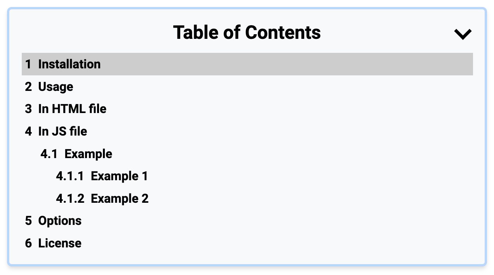

simple-toc
==========

A JavaScript plugin that creates a table of contents from headings in a document.



## Table of Contents

- [Installation](#installation)
- [Usage](#usage)
    - [In HTML file](#in-html-file)
    - [In JS file](#in-js-file)
- [Options](#options)
- [Licnse](#license)

## Installation

Install using npm:
```
npm install simple-toc
```

Install using yarn:
```
yarn add simple-toc
```

## Usage

### In HTML file
```html
<!-- Add this where you want the table of contents to appear -->
<div class="toc-wrap">
    <div class="toc-title">Table of Contents</div>
    <div id="toc"></div>
</div>
```

### In JS file
```js
// Import the plugin
import 'simple-toc'

// Initialize the table of contents
document.querySelector('article').toc({
  tocSelector: '#toc',
  tocIndent: true,
  smooth: true,
})
```

## Options
You can customize the behavior of the table of contents by passing an options object to the toc() method. The following options are available:

- `tocSelector` (default: '#toc'): This option specifies the selector for the container where the table of contents will be rendered. You can pass in any valid CSS selector as a string.
- `tocIndent` (default: true): This option specifies whether or not to indent the table of contents items based on their heading levels. If set to false, all items will be left-aligned.
- `smooth` (default: true): This option specifies whether or not to enable smooth scrolling to the clicked table of contents item. If set to false, the scrolling will be immediate.

## License
This library is licensed under the MIT License.